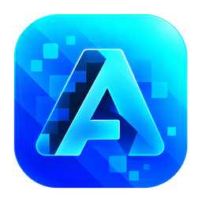

# Awake Launcher



A Minecraft: Java Edition launcher with Awake Launcher's desktop interface and Prism Launcher's C++ / Qt backend. Keep separate installations for vanilla Minecraft, modpacks, and custom setups, with control over each instance's Java runtime and launch settings.

[Build from source](BUILDING.md) · [Development builds](https://github.com/awakenginexe/Awake-Launcher/actions) · [Report an issue](https://github.com/awakenginexe/Awake-Launcher/issues) · [License](LICENSE)

## Development status

Awake Launcher is under active development. Windows x64 is the current build and validation target. Linux and macOS retain Prism's platform foundations but need validation with Awake Launcher before binary distribution. Development artifacts are unsigned and are not stable releases.

**Microsoft sign-in is currently blocked at Minecraft Services.** Awake Launcher's own application successfully completes Microsoft OAuth, Xbox Live, and XSTS, but Minecraft Services returns HTTP 403. Application approval/allowlisting may be required. Live Minecraft profile retrieval and token refresh have not been verified end to end. The launcher reports this separately from Microsoft sign-in failures.

## What Awake Launcher supports

- Separate instances with their own Minecraft versions, mods, worlds, and settings.
- Vanilla Minecraft and mod loaders, including Fabric, Quilt, Forge, and NeoForge.
- Modpack browsing and installation through Modrinth, CurseForge, FTB, Technic, and ATLauncher, subject to provider availability and credentials.
- Individual mod, resource pack, and shader management through the existing Prism integrations.
- Instance import/export, Java selection, memory limits, JVM arguments, and game logs.
- A Vue / TypeScript interface embedded in Qt WebEngine, with native C++ handling accounts, downloads, and game launching.

Awake Launcher is a general-purpose launcher. You choose your instances and servers. The project adds no telemetry, advertisements, or server lock-in.

## Getting started

1. Build locally using [BUILDING.md](BUILDING.md), or download the `Awake-Launcher-Windows-development` artifact from a successful [Windows development build](https://github.com/awakenginexe/Awake-Launcher/actions/workflows/awake-build.yml), when available.
2. Extract the complete portable package into a writable folder. Keep the executable, Qt dependencies, launcher libraries, and resource folders together. Windows portable builds require the Microsoft Visual C++ 2015–2022 x64 runtime.
3. Run `awakelauncher.exe`. Portable builds store launcher data beside the executable; back up that folder before replacing a build.
4. Use **Accounts** to add your Microsoft account and **Create instance** to choose a Minecraft version or modpack. Microsoft authentication must reach Minecraft Services successfully before an authenticated account can be added; see the current limitation above.

Awake Launcher uses its own configuration and data location. It does not automatically migrate Prism or other launchers' accounts and instances. Import instances explicitly and keep a backup of the original data.

## Accounts and service configuration

Microsoft login opens your system browser. Awake Launcher uses Authorization Code with PKCE, validates callbacks, and supports localhost callbacks for portable builds plus a Device Code fallback. Microsoft passwords are entered on Microsoft's page. Refresh tokens remain in the native backend and are not exposed to the web interface.

The default public Microsoft Client ID is `9f3c5cb3-82af-4a3e-ad36-2970397c2395`. Developers can override it with `Launcher_MSA_CLIENT_ID`; the existing `MSAClientIDOverride` setting is also retained. This is a public application identifier and requires no client secret.

CurseForge needs an API key. Published builds can supply a key owned by Awake Launcher through `Launcher_CURSEFORGE_API_KEY`; the Windows workflow reads the GitHub Actions secret `AWAKE_CURSEFORGE_API_KEY`. A user override is available under **Settings → Services → API Keys → CurseForge**. Builds without a key show a configuration diagnostic. Some files are unavailable for third-party download and require the provider's manual download flow.

Account files and service keys are sensitive. Keep them out of source control and public issue attachments. Forks and distributors should use their own service registrations and credentials. See [service configuration](BUILDING.md#service-configuration) for build details.

## Building and contributing

```sh
git clone --recursive https://github.com/awakenginexe/Awake-Launcher.git
cd Awake-Launcher
```

Follow [BUILDING.md](BUILDING.md) for the compiler, Qt, Java, Node.js, vcpkg, build, test, and packaging requirements. Node.js is a frontend build dependency; end users do not need it.

Bug reports should include the Awake Launcher version, operating system, reproduction steps, and sanitized logs. Back up instances before testing changes. Improvements to translations, provider compatibility, authentication diagnostics, and instance management are welcome.

Upstream revisions and maintenance rules are recorded in [UPSTREAM.md](UPSTREAM.md). Product direction is described in [the project brief](docs/PROJECT-BRIEF.md). Preserve Prism's instance formats, ownership checks, and launch behavior when changing the interface or backend.

## License and credits

Copyright © 2026 Awake Launcher Contributors.

Awake Launcher's code, including its Prism-derived code and changes made for Awake Launcher, is licensed under **GNU GPL version 3 only** (`GPL-3.0-only`). You may use, modify, and redistribute it under that license. Distribution must preserve required notices and provide corresponding source as required by the GPL. Read the complete terms in [LICENSE](LICENSE).

Third-party components keep their own licenses. [COPYING.md](COPYING.md) preserves copyright and dependency notices; [frontend notices](launcher/awake-web/THIRD-PARTY-NOTICES.txt) cover bundled web dependencies. Branding assets in `program_info/` are covered by [CC BY-SA 4.0](program_info/LICENSE), and the bundled Prism translations retain their [Apache-2.0 license](launcher/awake/translations/LICENSE).

Thanks to the Prism Launcher, PolyMC, and MultiMC contributors whose work forms the launcher foundation, and to the maintainers of its libraries and translations.

Awake Launcher is independently maintained and is not affiliated with or endorsed by Prism Launcher, MultiMC, Mojang, or Microsoft. Minecraft and related trademarks belong to their respective owners.
